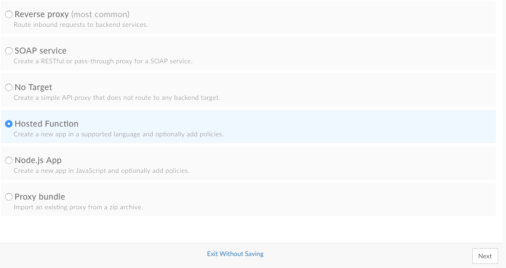
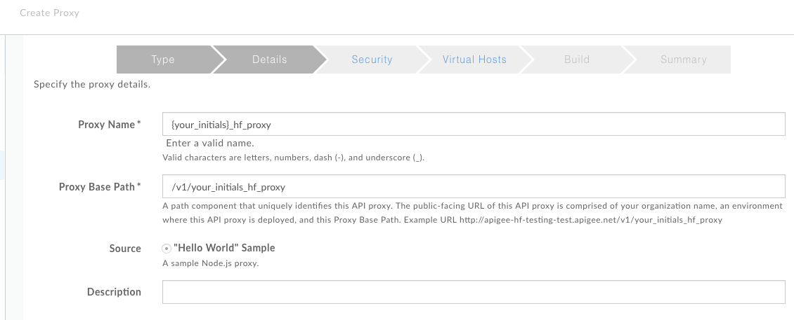
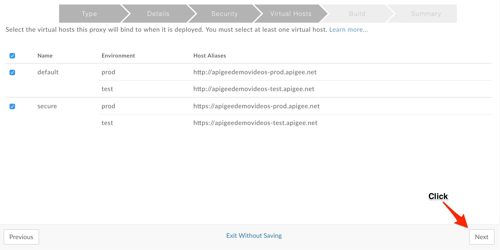
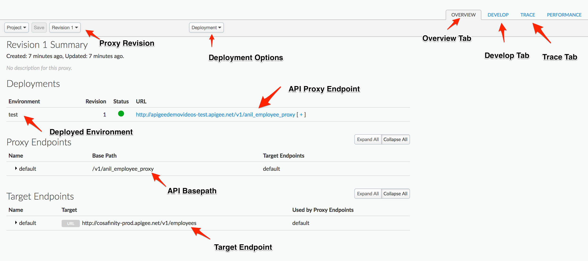
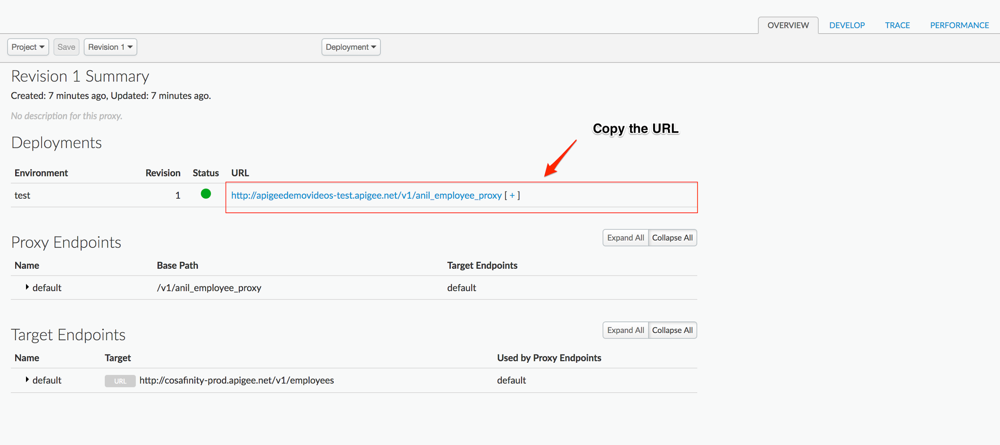
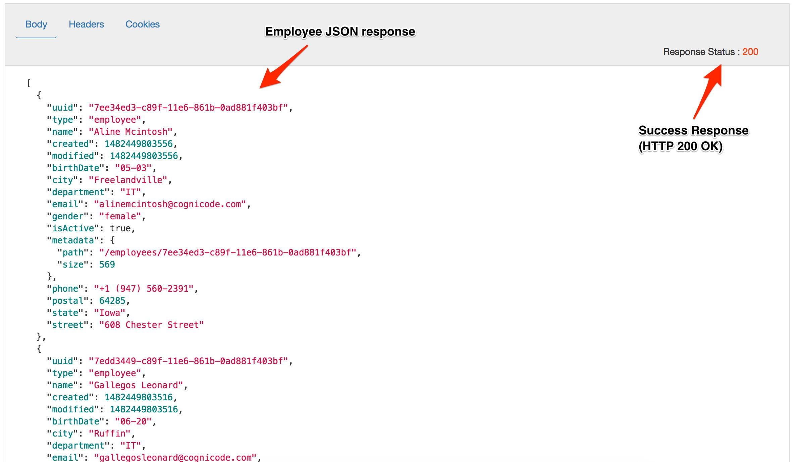
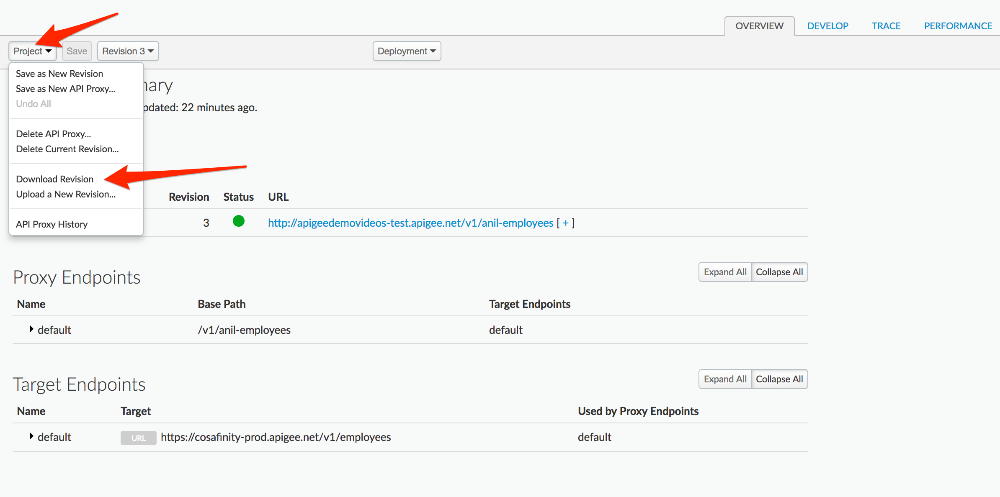

# API Development : Hosted Functions

*Duration : 20 mins*

*Persona : API Team*

# Use case

You have a proxy requirement where you want to aggregate the results of several API calls and to massage the output from each. These separate API calls should be executed in parallel.

# How can Apigee Edge help?

Hosted Functions provide a mechanism where customers can combine the rich support of policies with node.js apps deployed automatically by Apigee. The use case described here is best solved with real code. Through some simple code a developer can unambiguously handle the individual calls, aggregate and massage the output and with an eye to parallel execution.

In this lab we'll be creating a hosted function that utilizes node.js to parallelize several backend calls and then combine the results into a single response.

# Pre-requisites

* Basic understanding of [node.js](https://nodejs.org/en/) (Serverside Javascript)

# Instructions

## Create a "Hosted Function" API Proxy

1. It’s time to create Apigee API Proxy from Open API Specification. Click on **Develop → API Proxies** from side navigation menu.

2. Click **+Proxy** The Build a Proxy wizard is invoked. 

3. Select **Reverse proxy**, Click on **Use OpenAPI** below reverse proxy option.

4. Enter details in the proxy wizard. Replace **{your-initials}** with the initials of your name. 

    * Proxy Name: **{your_initials}**_hf_proxy

    * Proxy Base Path: /v1/**{your_initials}**_hf_proxy

5. Select **Pass through (none)** for the authorization in order to choose not to apply any security policy for the proxy. Click Next. 

6. Go with the **default Virtual Host** configuration.

7. Ensure that only the **test** environment is selected to deploy to and click **Build and Deploy** 

8. Once the API proxy is built and deployed **click** the link to view your proxy in the proxy editor. 

9. *Congratulations!* ...You have now built a hosted function proxy. You should see the proxy **Overview** screen.

## Test the API Proxy
1. Let us test the newly built API proxy using the [REST Client](https://apigee-rest-client.appspot.com/). Open the REST Client on a new browser window.  

2. Copy the URL for your API proxy. 

3. Paste the link into the REST Client and make a GET call

4. You should see a success response similar to this -

## Save the API Proxy

1. Let’s save the API Proxy locally as an API Bundle so that we can reuse it in other labs.

2. Save the API Proxy by downloading the proxy bundle, See screenshot below for instructions.

# Lab Video

If you like to learn by watching, here is a short video on creating a reverse proxy using Open API Specification - [https://www.youtube.com/watch?v=3XBG9QOUPzg](https://www.youtube.com/watch?v=3XBG9QOUPzg) 

# Earn Extra-points

Now that you have created a reverse proxy using OpenAPI spec, Click on the Develop tab & explore the flow conditions populated from OpenAPI spec. Also, Explore OpenAPI Spec editor using which you can edit OpenAPI specification & Generate API Proxy using the link above the OpenAPI Spec editor. Explore trace tab in Proxy overview page.

# Quiz

1. How do you import the proxy bundle you just downloaded? 
2. How does Apigee Edge handle API versioning? 
3. Are there administrative APIs to create, update or delete API proxies in Apigee?

# Summary

That completes this hands-on lesson. In this simple lab you learned how to create a proxy for an existing backend using OpenAPI Specification and Apigee Edge proxy wizard.

# References

* Useful Apigee documentation links on API Proxies - 

    * Build a simple API Proxy - [http://docs.apigee.com/api-services/content/build-simple-api-proxy](http://docs.apigee.com/api-services/content/build-simple-api-proxy) 

    * Best practices for API proxy design and development - [http://docs.apigee.com/api-services/content/best-practices-api-proxy-design-and-development](http://docs.apigee.com/api-services/content/best-practices-api-proxy-design-and-development) 

* Watch this 4minute video on "Anatomy of an API proxy" - [https://youtu.be/O5DJuCXXIRg](https://youtu.be/O5DJuCXXIRg) 

# Rate this lab

How did you like this lab? Rate [here](https://goo.gl/forms/G8LAPkDWVNncR9iw2).

Now go to [Lab-2](https://github.com/apigee/devjam3/tree/master/Labs/Core/Lab%202%20Traffic%20Management%20-%20Throttle%20APIs)

