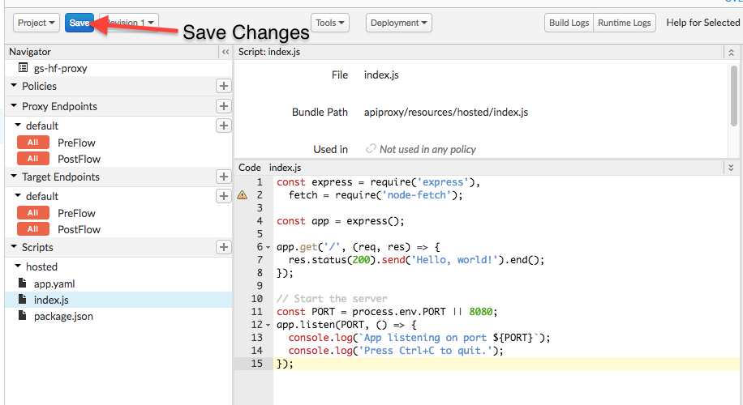

# API Development : Hosted Targets : Developing Offline

*Duration : 20 mins*

*Persona : API Team*

# Use case

Sometimes you may need or desire to work on your script while offline. One of the many advantages to working with Hosted Targets is that this is both possible and easy assuming you have the tooling required on your local workstation.

# Pre-requisites

* Basic understanding of [node.js](https://nodejs.org/en/) (Serverside Javascript)
* Basic understanding of [curl](https://curl.haxx.se/) (A CLI for working with remote URLs such as REST APIs)
* A locally installed setup for node.js including npm (The node package manager)
* A locally installed editor (Sublime, Atom, Notepad++, Webstorm, etc.)
* The GIT cli locally installed as this tutorial assumes it's use

# Instructions

## Clone the APIJAM Repository and install the dependencies

1. Open up a command line and change to a directory where you wish to clone the repository
```bash
mkdir dev
cd dev
git clone git@github.com:apigee/apijam.git
```

2. Now let's change to the directory where these scripts are stored
```bash
cd apijam/Labs/Appendix/API\ Development\ -\ Hosted\ Targets/scripts
```

3. This directory contains a package.json file already (The same one you used in the first lab). We can now install all dependencies here
by simply running:
```bash
npm install
```

4. Now you should see a `node_modules` directory containing all the dependencies

## Run and test a hosted target locally
1. Now that we have the scripts directory ready we can execute the `first.js` script directly from your local machine. Execute the script by simply runnin node against it:

```bash
node first.js
```

2. You should see output like the following:
```
App listening on port 8080
Press Ctrl+C to quit.
```
Go ahead and open a new terminal and run curl against the local port: 8080 like so:
```bash
curl http://localhost:8080
```
You should have now been rewarded with the same `Hello, World!` seen when you ran this inside of apigee

3. Let's cancel out of that process. Return to the terminal where you started first.js and hit `ctrl-c` to cancel the process.

## Create a whole new script and test it locally
1. Our first example was quite simple. Now let's do something a little more interesting. Open up an editor and create a new script in this directory called `tryIt.js` and insert the following lines.
```javascript
const express = require('express'),
  fetch = require('node-fetch');

const app = express();
const routeURL = 'http://maps.googleapis.com/maps/api/directions/json';

/*
 * Fetch routing info passed in as query parameters
 */
function getRoute(from,to)  {
  let url = `${routeURL}?origin=${from}&destination=${to}`;
  console.log('About to fetch: ', url);
  return fetch( url )
    .then( d => d.json() )
    .then( route => route.routes[0].legs[0] )
}

app.get('/', (req, res) => {
  res.status(200).send('Hello, world!').end();
});

app.get('/route', (req, res) => {
  getRoute( req.query.from, req.query.to )
    .then( d => {
      res.status(200).json(d).end();
    });
});

// Start the server
const PORT = process.env.PORT || 8080;
app.listen(PORT, () => {
  console.log(`App listening on port ${PORT}`);
  console.log('Press Ctrl+C to quit.');
});
```

This script relies on the same express library for parsing URL paths but adds a whole new path: `/route`. This new path relies on a promise returned from the `getRoute` function. That function is using the fetch-sdk to make a REST call to the google routing API. Essentially, it's a node.js API proxy for the existing google proxy. Try it out by passing in some from and to locations and examine the output. NOTE: This API is a bit finnicky and prefers specific from and to locations: City, State or City, Country style locations.

2. Let's start the new tryIt.js script like so:
```bash
node tryIt.js
```

3. Try out the following example showing the driving directions between Uppsala, Sweden to Stockholm, Sweden:
```bash
curl 'http://localhost:8080/route?from=Stockholm%2CSweden&to=Uppsala%2CSweden'
```

or this one which looks at the directions from Toronto, Canada all the way to Jacksonville, Florida.
```bash
curl 'http://localhost:8080/route?from=Toronto%2C&to=Jacksonville%2CFL'
```

4. Let's cancel out of that process. Return to the terminal where you started first.js and hit `ctrl-c` to cancel the process.

## Now lets update the proxy inside of apigee
1. Navigate back to your proxy and go to the develop tab


2. Now click on the `index.js` file from the scripts pane in the lower left hand corner.


3. Now update the script with the same file from above in the previous section

4. Save the script which will deploy it to the hosted targets backend


5. Test it by using one of your previous curl tests and update the url appropriately. Here's an example: `https://apigee-hf-testing-test.apigee.net/gs-hf-proxy/route?from=Toronto%2CCanada&to=Austin%2CTX%2CUSA`

# Quiz

1. Would it be possible to do the same thing but inside an unarchived apiproxy bundle stored locally?
2. Could you then package up that local apiproxy and deploy it as a bundle?

# Summary

That completes this hands-on lesson. In this simple lab you learned how to do hosted targets development on your local machine and then you leanred that you could take that same script and move it directly to your running proxy.

# References

* TBD ... we don't have anything to link here yet


# Rate this lab

How did you like this lab? Rate .. to be filled in later
