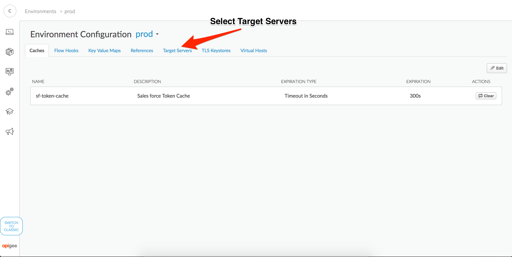
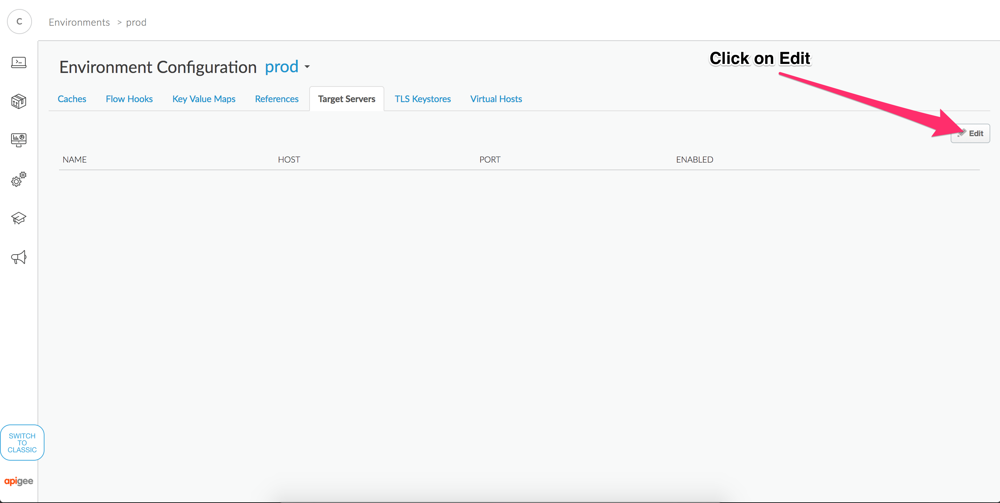
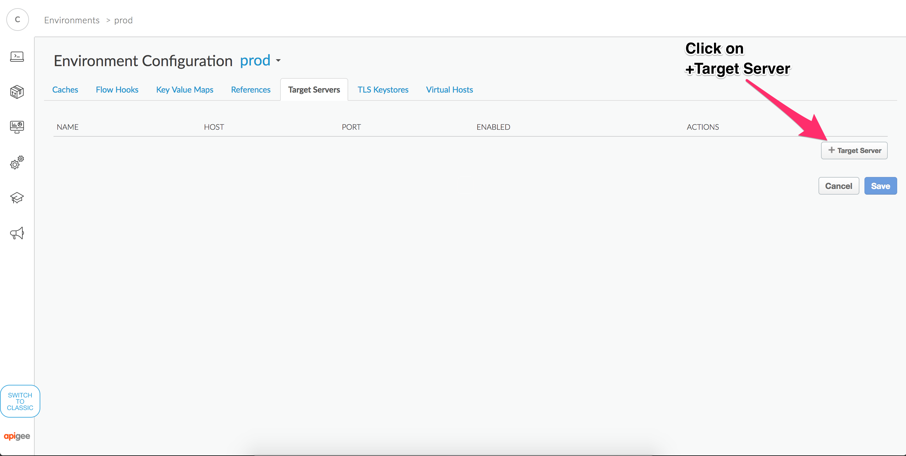
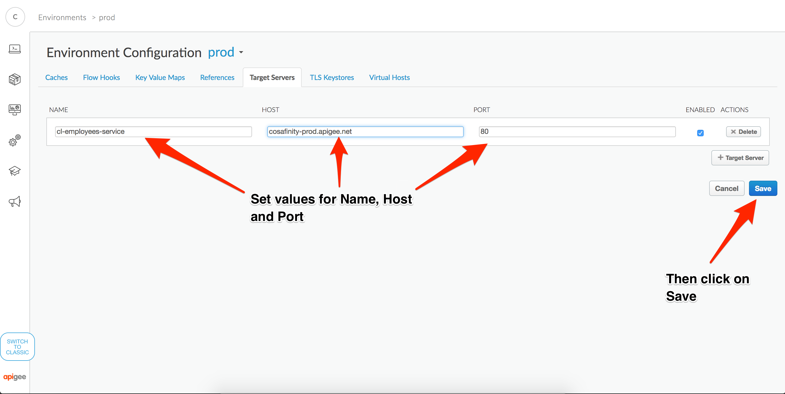
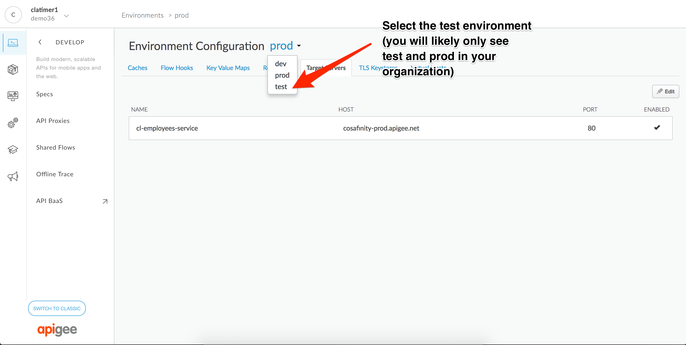
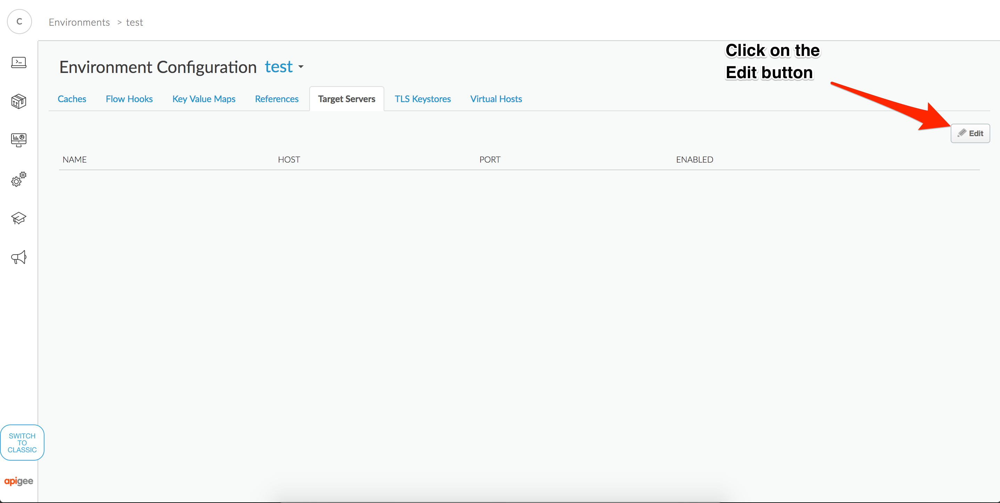
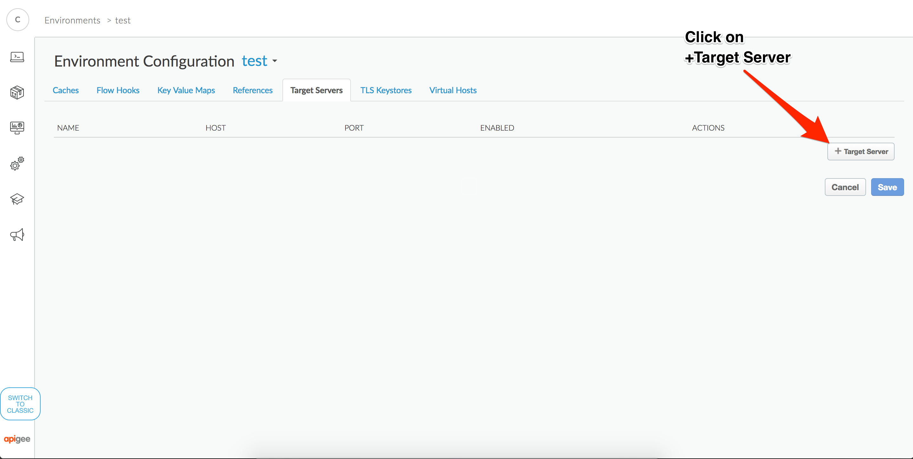
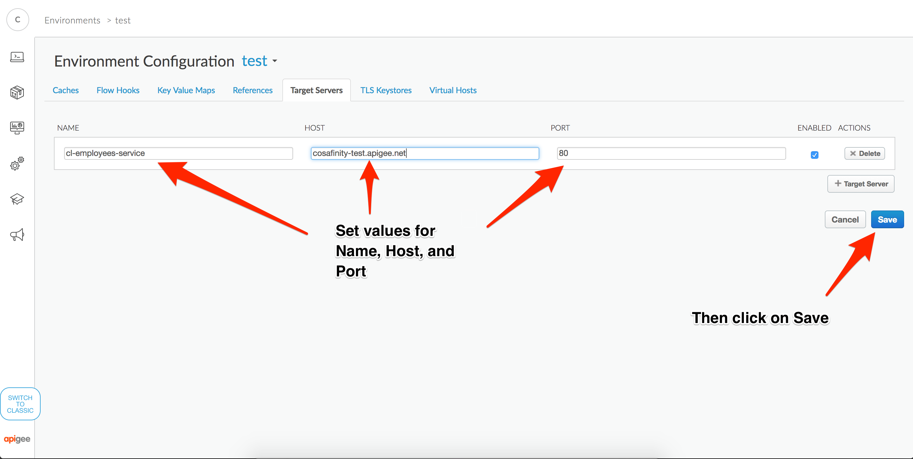

# API Development : Externalize Target URLs using Target Servers

*Duration : 20 mins*

*Persona : API Team*

# Use case

Backend target URLs often change as an API is promoted from development through testing and finally into production. The ability to externalize these endpoints ensures you can take your API configuration and promote it through your SDLC without making manual changes as part of your deployment/promotion process.

# How can Apigee Edge help?

Apigee Edge includes the ability to externalize your backend target URL through a concept known as *Target Servers*. Target Servers are configured for each environment and allow you to replace a static target URL in your API Proxy definition with a named target server that is automatically replaced at runtime. 

# Pre-requisites

None

# Instructions

* Go to [https://apigee.com/edge](https://apigee.com/edge) and log in. This is the Edge management UI. 

* On the left hand menu, navigate to *Admin->Environments*:

* In the Environments Configuration page, select the Target Servers tab:

* Click on the Edit button in the top right corner of the target servers tab

* Click on the *+Target Server+ button to add a new target server

* Making sure the prod environment is selected, enter the following values for your production target server:

Name: employees-service
Host: cosafinity-prod.apigee.net
Port: 80
Enabled: checked

You should see a message indicating your target server was created successfully and your new target server should be displayed on the sreen.

* Using the environment drop down, change to the *test* environment:

* Click on the Edit button in the top right corner of the target servers tab

* Click on the *+Target Server+ button to add a new target server

* Making sure the test environment is selected, enter the following values for your test target server:

Name: employees-service
Host: cosafinity-test.apigee.net
Port: 80
Enabled: checked

