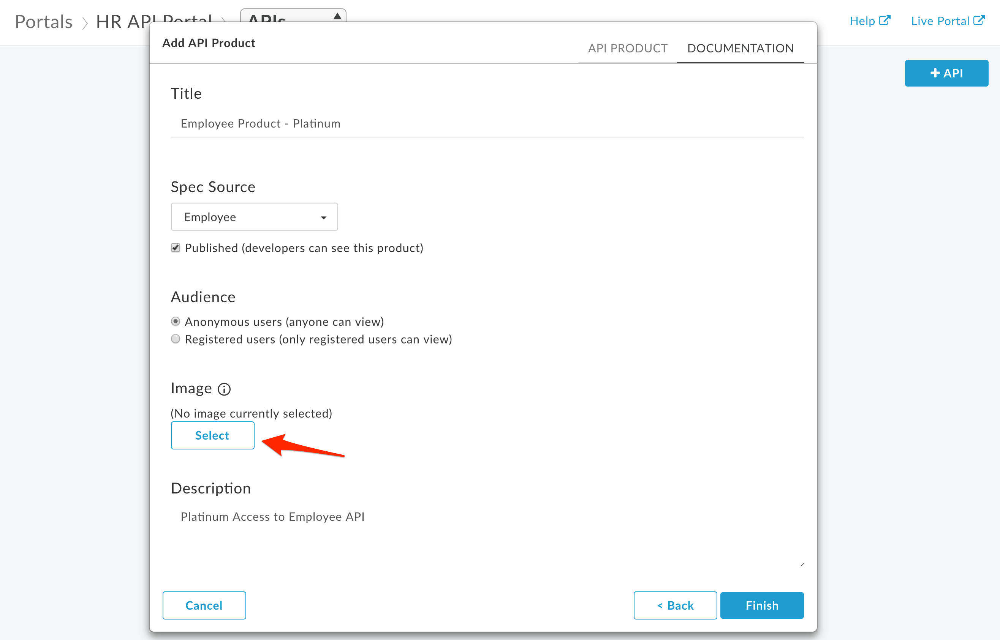
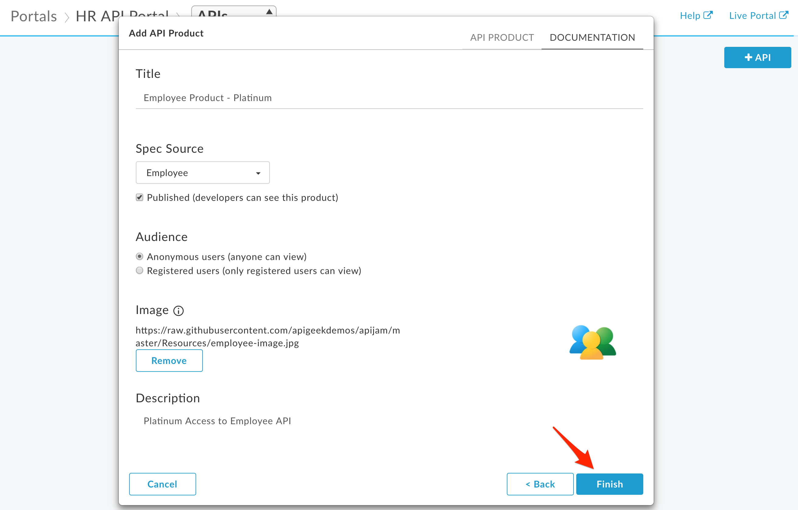
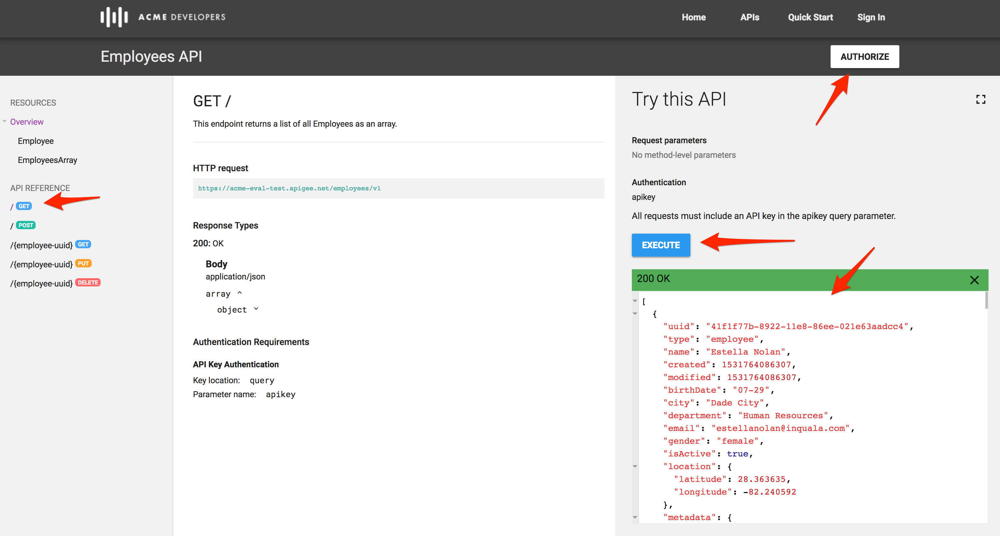
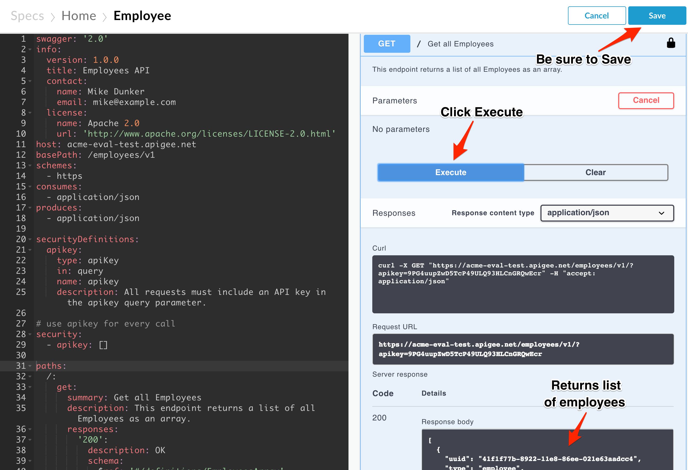
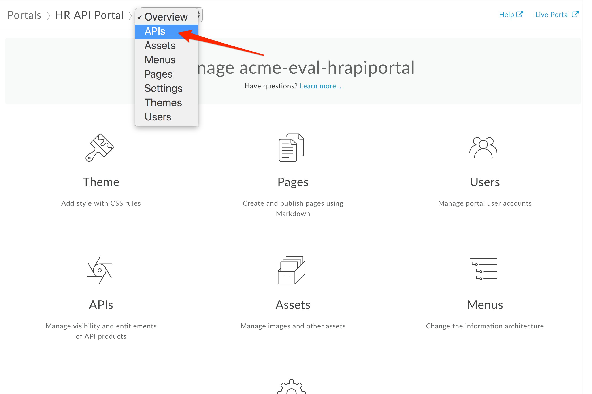
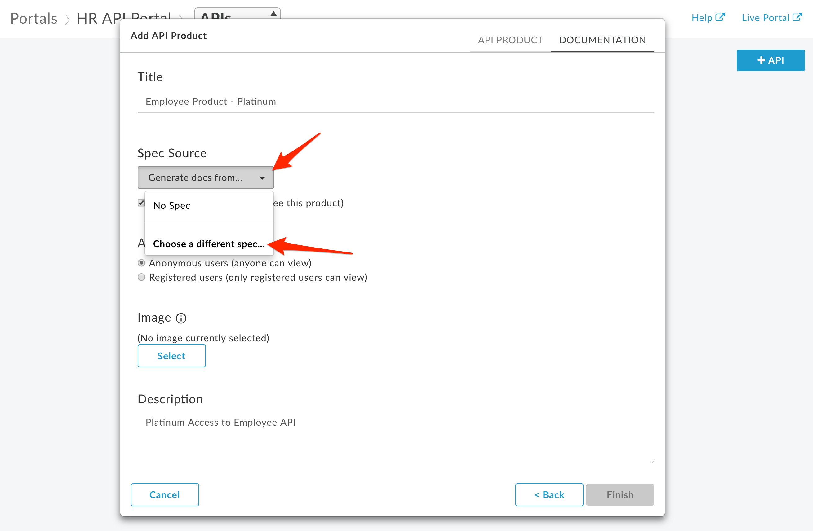

# Publishing APIs : Publish documentation

*Duration : 20 mins*

*Persona : API Team*

# Use case

You have an API Proxy that you would like to share with App Developers.  You want to enable developers to learn about, register for, and begin using your API Proxy.

# How can Apigee Edge help?

Apigee Edge provides multiple options for your Developer Portal.  There is a lightweight portal that supports branding and customization of much of the site, such as theme, logos, and page content.  The lightweight portal can be published in seconds, directly from the management UI.  We also provide a Drupal-based portal if you want full control and to leverage any of the hundreds of Drupal modules available in the Drupal Market.  This lab focuses on the lightweight Apigee Developer Portal.

In this lab, you will create a Developer Portal and publish an OpenAPI specification for your API that can be used by developers.

# Pre-requisites

For this lab, you will need…

* An OpenAPI specification for your API.  This specification is not the same as the backend API specification. You will use the backend OpenAPI Specification used during the lab *API Design : Create a Reverse Proxy with OpenAPI Specification* as a starting point.

* An API Product that contains the API Proxy related to the above OpenAPI Specification.  If you have not created an API Product, revisit the lab *API Security: Securing APIs with API Keys* and then return here to complete these steps.

# Instructions

## Create your OpenAPI Specification

1. Go to [https://apigee.com/edge](https://apigee.com/edge) and log in. This is the Edge management UI

2. Select **Develop → Specs** and open the existing **{your-initials}**_employee_backend_api_spec specification.


3. Note that this API specification is for the API's backend, not the Edge proxy API itself. For example, the documented Base URL is for the backend, and the specification does not include the API keys we use in our API. We will use the backend OpenAPI specification as the starting point for our API specification.

4. Return to the Specs page (**Develop → Specs**) and click **+Spec.** Click on **Import URL** to add a new spec from existing source.


5. Enter spec details for our API proxy. We will use the same starting spec we used for the backend specification. Replace **{your-initials}** with the initials of your name.

   * File Name: **{your-initials}**_employee_api_spec

   * URL: [https://raw.githubusercontent.com/apigeekdemos/apijam/master/Resources/employee-openapi-spec.yaml](https://raw.githubusercontent.com/apigeekdemos/apijam/master/Resources/employee-openapi-spec.yaml)



6. Now we'll modify the API spec to represent our API proxy, instead of our backend.

   * Title: Rename the API.

   * Contact information: This should represent the contact information for your API proxy. Replace the name and email address with your name and email address.

   * Host: Change the hostname to point to your Edge organization (**{orgname}-test.apigee.net**).

   * BasePath: Change the basepath to match the basepath used for your API proxy (**/v1/{your_initials}_employee_proxy**).

   * Schemes: Remove the **http** scheme. We made our API available only via https.


7. We also need to add the API key as a security feature of our APIs. We'll do this by adding [a security requirement object and definition](https://github.com/OAI/OpenAPI-Specification/blob/master/versions/2.0.md#securityRequirementObject) to the root of our OpenAPI spec. The securityDefinitions section specifies the types of security we use. The security section is used to apply the security. By providing an empty apikey security array, we are applying the API key security to all calls. Note the new **Authorize** button toward the top of the right pane.

```

securityDefinitions:
  apikey:
    type: apiKey
    in: query
    name: apikey
    description: All requests must include an API key in the apikey query parameter.

# use apikey for every call
security:
  - apikey: []

```



8. Let's validate a call using this page. Find the same API key you used during the lab *API Design : Securing APIs with API Keys*. Click the **Authorize** button to open a dialog for entering your key. Paste in your API key and click **Authorize**.


9. Click the **Done** button.


10. Select the **Get all Employees** section by clicking it, and then click the **Try it out** button.


11. Click the **Execute** button.


12. If you successfully made the call, you should be able to see the curl command, and also see the response below. If you can't see these, try tracing your API using the trace tool to figure out what is happening. **Make sure you save your specification.**



## Publish a new Portal on Apigee Edge

1. Now that our API proxy specification exists, let's create the portal. Select **Publish → Portals → +Portal**


2. Enter details in the portal creation wizard. Replace **{your-initials}** with the initials of your name and replace **{api_proxy_name}** with the name of the proxy.

  * Name: **{your_initials}**_**{api_proxy_name}**_portal

  * Description: Enter a brief description

3. Click **Create Portal**


## Publish an API Product to the Portal

1. Click the Portal Editor’s dropdown and select **APIs** from the list of sections


2. Click **+API** to select an API Product to publish to the Portal


3. Select the API Product to publish


4. Choose a Spec Source.  

  * Your Spec will become the first Snaphot of the documentation.  A Snapshot represents a version of the OpenAPI Specification at a particular point in time.  The Source is the OpenAPI Specification used to generate the Snapshot.  Because the specification might change over time, you take snapshots so that your Portal will reflect the version of the specification that is published, which may differ from the version under current development.  Read [this document](https://docs-new.apigee.com/publish-apis#snapshot-overview) to better understand snapshots.



5. Select the OpenAPI Specification from which to create a Snapshot.


6. Review selections and click **Finish** to publish the API product (and OpenAPI Specification Snapshot) to the Developer Portal


## Review Published API Product

1. Click the **Live Portal** link to launch a browser tab/window with the new Developer Portal.



2. In the Portal UI, click **APIs** to view the products that have been published. 

  * For demonstrative purposes, the screenshot includes multiple products. Products are used to bundle APIs together so that a developer can request access to a set of related functionality without registering for each API.  They are also useful for managing access to, and quotas for, particular developers.  For more on API Products, [read this document](http://docs.apigee.com/developer-services/content/what-api-product).


3. Click an API product to view documentation.

  * The Portal will display the OpenAPI Specification (Swagger UI) for browsing the APIs included in the product.  The view below contains two collapsed operations and one expanded to show the details of the operation.  Depending on the method, you’d expect to see model details, response codes, etc., as per the [OpenAPI Specification](https://github.com/OAI/OpenAPI-Specification/blob/master/versions/2.0.md).



If you have problems using the "Try it out" functionality of the API documentation, make sure you have have the [CORS functionality](https://docs.apigee.com/api-platform/develop/adding-cors-support-api-proxy) that was added during the *API Design : Securing APIs with API Key* lab.

# Lab Video

If you would rather watch a video that covers this topic, point your browser [here](https://www.youtube.com/watch?v=_gDpzDJPNQg).

# Earn Extra-points

Try your hand at managing OpenAPI Snapshots.  Modify your OpenAPI Spec and introduce the new changes to your portal, as a new Snapshot.

Add a second product to the portal and test it by launching the Live Portal.

# Quiz

1. What are two reasons why you might publish multiple API Products to the Developer Portal?

2. Changes made to OpenAPI Specification are made available in the Developer Portal automatically.  True or False?

# Summary

You’ve learned how to do the following;

* Deploy the Apigee Lightweight Developer Portal

* Publish an API Product with an OpenAPI Specification

* Use the Developer Portal UI to browse the OpenApi Specification Snapshot as a developer.

# Rate this lab

How did you link this lab? Rate [here](https://goo.gl/forms/j33WG2U0NFf02QHi1).

Now go to [Lab-7](../Lab%207%20API%20Publishing%20-%20Developer%20Portal%20Customization)
