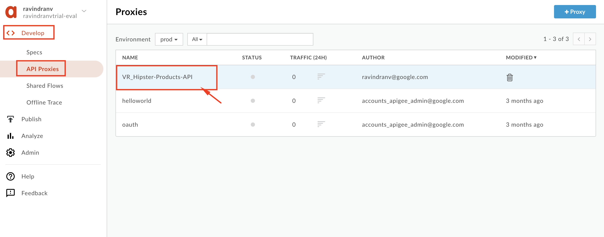
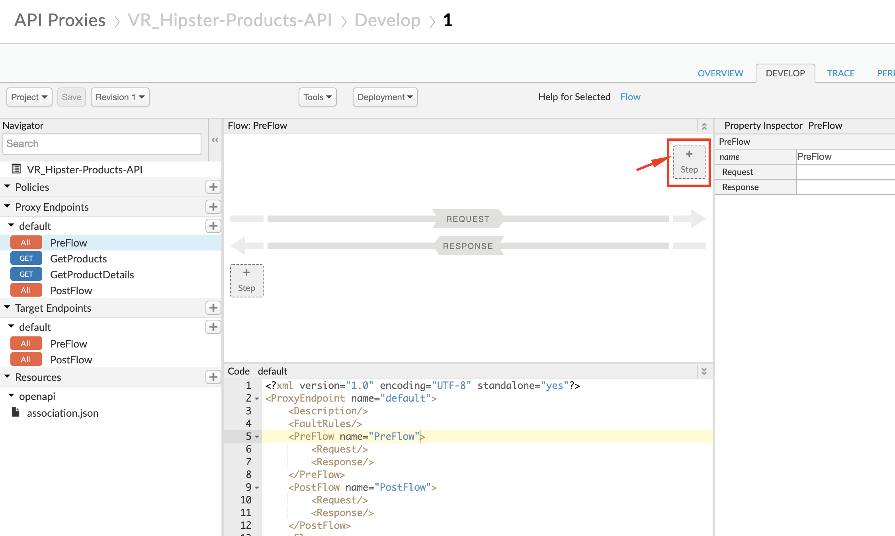
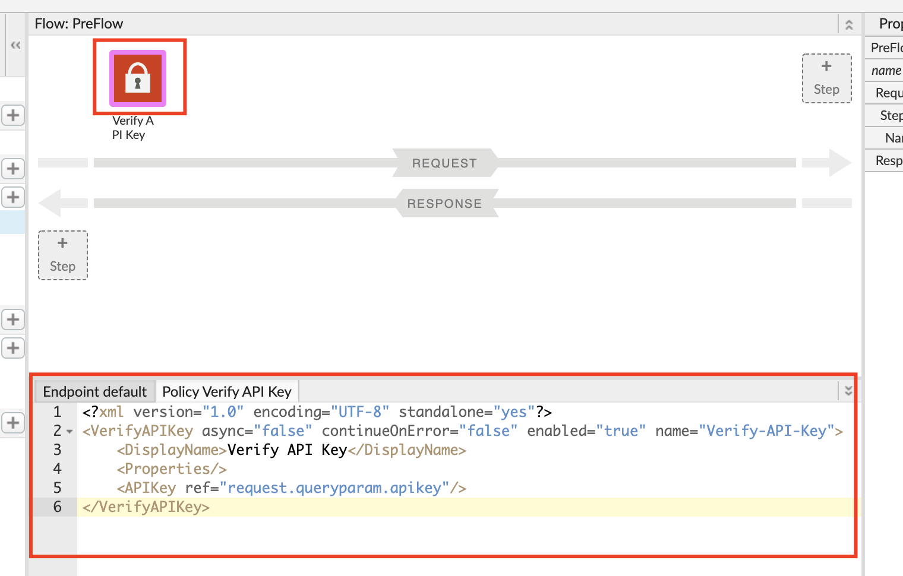
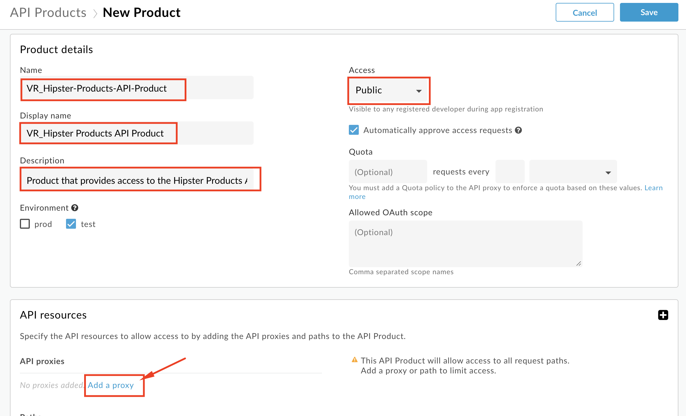
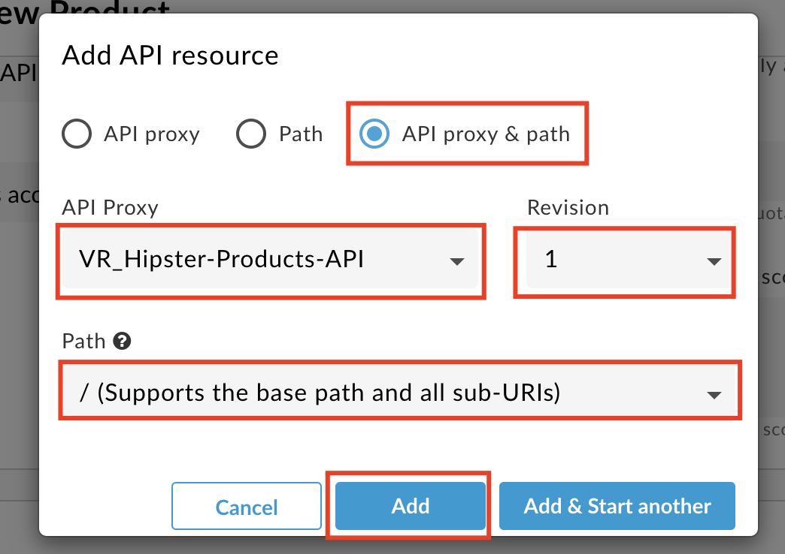
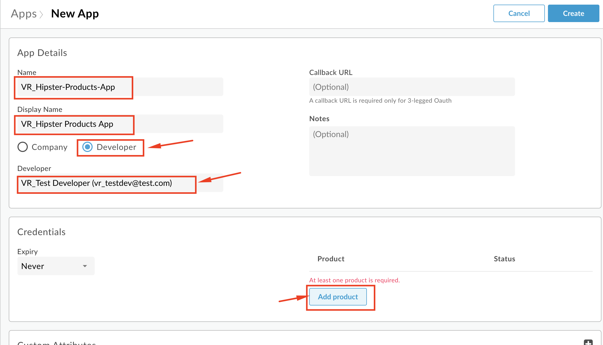
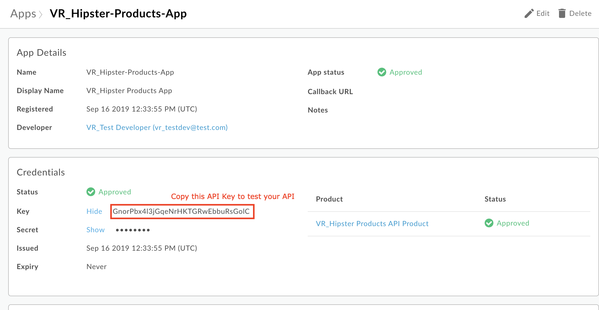

# Lab 2 - API Security and API Producer/Consumer Relationship on Apigee Edge

*Duration : 20 mins*

*Persona : API Team*

# Use case

You have an API that you want to secure and expose for consumption by different Apps (API clients).  In addition to setting up authorized access to the API, you also want to be able to identify and control which App is making calls to the API so you can customize API behavior based on the the caller, or gather data on consumption patterns by differnt Apps and view that data through Analytics dashboards.

# How can Apigee Edge help?

## API Proxy - API Product - App Relationship

On Apigee Edge, in order to secure an API and control access by consumers, we need to first understand the relationship between API Proxies, API Products and Apps.

While the API Proxy allows you to expose the API endpoint according to API design specification, it also serves to decouple the API backend (target service) from the front end (client Apps), and in turn API production from consumption. This is accomplished by creating 'API Products', which are configurations that define how an API can be consumed. The API Product configuration may contain metadata that defines rules for consumption of the API through the particular API Product. These rules may include allowed consumption quota (Eg. 100 API calls per minute), visibility (Public vs Private vs Internal), API resource restrictions (Eg. Only /products resource URL may be called, but not /products/{product ID}), which API deployment environment the caller is allowed to access (Eg. test, prod), etc.
Once the API Products are created, client Apps can then subscribe to them. On subscription, Apigee automatically generates and provisions an API Key/Secret pair for the App. These credentials can then be used to call the API endpoint with authentication and authorization, from within App code.


## API Proxy Configuration

While Apigee provides multiple ways of securing an API and authorizing API calls - including [API Keys](https://docs.apigee.com/api-platform/security/api-keys), [OAuth](https://docs.apigee.com/api-platform/security/oauth/oauth-home), [JWT Tokens](https://docs.apigee.com/api-platform/reference/policies/jwt-policies-overview) and [SAML](https://docs.apigee.com/api-platform/reference/policies/saml-assertion-policy.html) - this lab will focus on using simple API Key validation to secure an API.

Within the API Proxy, the [Verify API Key Policy](http://docs.apigee.com/api-services/reference/verify-api-key-policy) can be used to authenticate and authorize incoming API calls, based on API Key validation.
As a result of successful API Key validation, the [Verify API Key Policy](https://docs.apigee.com/api-platform/reference/policies/verify-api-key-policy) also populates the API Proxy runtime context with details about the App making the call, the App developer, the API product associated with the call, and so on.  This context can then be used to parameterize other policies applied, in order to affect API behavior such as quota enforcement or routing based on the client App. The data can also be extracted and used to gain business insights through Apigee Analytics.

In this lab, you will..
* Configure a [Verify API Key Policy](https://docs.apigee.com/api-platform/reference/policies/verify-api-key-policy) for an existing API proxy, and use the Apigee Trace tool to see the policy in action.  
* Bundle the API Proxy into an API Product, and
* Register an App within your Org, that subscribes to the API Product, to test authorized consumption of the API.

# Pre-requisites

For this lab, you will need an API proxy that is not currently secured.  If you do not have an API proxy available for this lab, revisit the lab ["API Design : Create a Reverse Proxy from OpenAPI Spec"](../Lab%201) and then return here to complete these steps.

# Instructions

## Choose and test the API Proxy to secure

1. Log into the Apigee Edge Management UI at [https://login.apigee.com](https://login.apigee.com). Navigate to  **Develop → API Proxies**, and select the API Proxy (labeled **{your_initials}**\_Hipster-Products-API) that you created in [Lab 1](../Lab%201).



2. Verify that the API proxy is deployed to an environment from the **Overview** page.  Environment(s) to which the selected revision of the API proxy is deployed will be indicated by a green circle.  If it is not deployed, click an environment from the "Deployment" pull-down to deploy the API proxy to that environment.


3. Verify that you can successfully make calls using the built-in trace tool.

* Click the **Trace** tab near the top of the window.

* The Trace view allows you to initiate tracing for up to 10 minutes, during which time all requests (regardless of whether they are sent from the trace tool or any other client) will be captured and their traces made visible to you.

* Click **Start Trace Session** to begin a trace session.

* If you're using the API proxy you built in the [previous Lab](../Lab%201), add the `/products` resource path to the URL prior to sending a sample API call request. Click **Send** to send a request.

* You should see a successful 2xx response for your API Call (it may take a few seconds for the trace results to appear)


## Add a Verify API Key Policy

1. Navigate to **Develop > API Proxies** in the side menu, and open your API proxy. Click the **Develop** tab (in the upper right area of the page) to see the flow editor (you may have to move the panes to see the full request and response flow lines)

2. Click **+Step** on the request flow.



3. Select *Verify API Key* policy from the *Security* section of the list.  The name can be changed or left at the default. Click **Add**


* The policy will be added after any policies you previously had in the Request flow.  Since we likely want this to occur first, drag the new policy to be the leftmost of any policies in the flow.

* With the *Verify API Key* policy selected, you can see its configuration (the default policy configuration is below).  Note that the API Key is being retrieved from the context as the variable *request.queryparam.apikey*.  This is the default but the policy can be configured to retrieve the key from any parameter key you prefer.

```
<?xml version="1.0" encoding="UTF-8" standalone="yes"?>
<VerifyAPIKey async="false" continueOnError="false" enabled="true" name="Verify-API-Key">
    <DisplayName>Verify API Key</DisplayName>
    <Properties/>
    <APIKey ref="request.queryparam.apikey"/>
</VerifyAPIKey>
```



* **Save** the API proxy.

4. Click the **Trace** tab near the top of the window and click **Start Trace Session** to begin a trace session.

* If you're using the API proxy you built in the [previous Lab](../Lab%201), add the `/products` resource path to the URL prior to sending a sample API call request. Click **Send** to send a request.  

* You should see a 401 (unauthorized) response for your API Call because the API proxy was expecting an API Key as a query parameter.  See the trace session below

* NOTE: In subsequent steps, you will get an API Key that will allow you to make this API call successfully.


## Create API Product

1. Select **Publish → API Products** from the side navigation menu, and click the **+API Product** button.


2. Populate the following fields

**_Note_**: _Replace {{your initials}} with your initials, so as to not accidentally modify other developers work. Eg. API product 'Name = xx_Hipster-Products-API-Product'._

   * Section: Product details

        * Name: `{{your initials}}_Hipster-Products-API-Product`
        
        * Display name: `{{your initials}}_Hipster Products API Product`

        * Description: `Product that provides access to the Hipster Products API.`

        * Environment: `test`

        * Access: `Public`

   * Section: API resources

        * Section: API Proxies

           * Click the **Add a proxy** link

           

           * In the popup window, select the **API Proxy & path** radio button. Then select your Hipster Products API Proxy (with deployed revision), select the `/` option for Path, and click **Add**.

           

3. **Save** the API Product.


Note: We are adding the entire API Proxy to the API Product.  We can just as easily select one or more operations from one or more API proxies and bundle them together in an API Product.

## Manually register App from Management UI & generate API Key

1. Select **Publish → Developers** from the side navigation menu, and click the **+Developer** button.


2. Populate the following details:

	* First Name: `{{your initials}}_Test`

	* Last Name: `Developer`

	* Username: `{{your initials}}_testdev`

	* Email: `{{your initials}}_testdev@test.com`

3. Click **Create**


4. Select **Publish → Apps** from the side navigation menu, and click the **+App** button.


5. Populate the following details:

	* Name: `{{your initials}}_Hipster-Products-App`

	* Disaplay Name: `{{your initials}}_Hipster Products App`

	* Select the `Developer` radial option.

	* Select the developer you previously created.

	* Click the **Add Product** button.

	

	* Select the API Product you previously created, and click **Add**.

	

6. Click the **Create** button to save.

	

7. Once created, you will then see that Apigee has generated an API Key and Secret pair for the App. Click on the 'Show' link next to the Key, and **copy this API Key**.



You can now use this API Key to make a valid API request to your API Proxy.

## Test your API with a valid API Key

1. Navigate to **Develop > API Proxies** in the side menu, and open your API proxy. Click the **Trace** tab near the top of the window and click **Start Trace Session** to begin a trace session.

2. Add the `/products` resource path to the URL prior to sending a sample API call request. In addition, add a query parameter called `apikey` with the value of the API Key you copied. Click **Send** to send a request. 

3. You should now see that the API request returns a 200 OK response, as the Verify API Key policy has found the API key to be valid.


# Lab Video

If you would rather watch a video that covers this topic, point your browser [here](https://youtu.be/3nUFCOgGlS8).

# Quiz

1. Why is the Verify API Key policy typically found as the first policy in the Request PreFlow?  When might it be in a conditional PreFlow instead of the "All" PreFlow?

2. How would you configure the policy to get the API Key from a header called "Api-Key" instead of the default query parameter location?

# Summary

In this lab you learned how the relationship between API Proxies, API Products and Apps, helps obfuscate API production from API consumption; and how to protect your API proxy using the Verify API Key policy.  You then implemented the policy and tested it using the built-in Trace Tool.

# References

* Link to Apigee docs page

    * Verify Api Key Policy [https://docs.apigee.com/api-platform/reference/policies/verify-api-key-policy](https://docs.apigee.com/api-platform/reference/policies/verify-api-key-policy)

# Rate this lab

How did you like this lab? Rate [here](https://goo.gl/forms/XxDqVtWHnyFdEChv1).

Now go to [Lab-3](../Lab%203)

