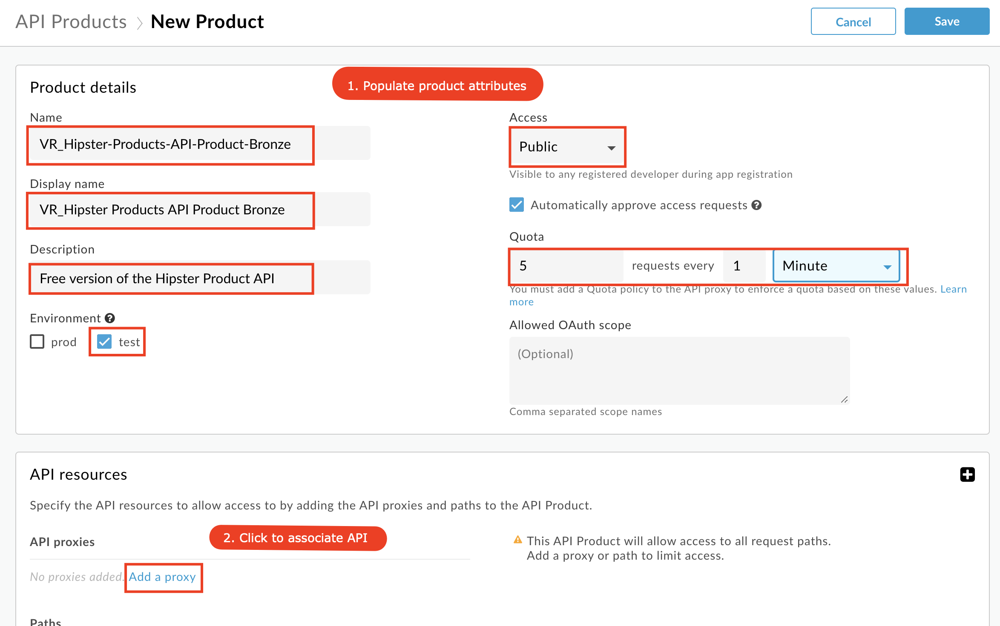
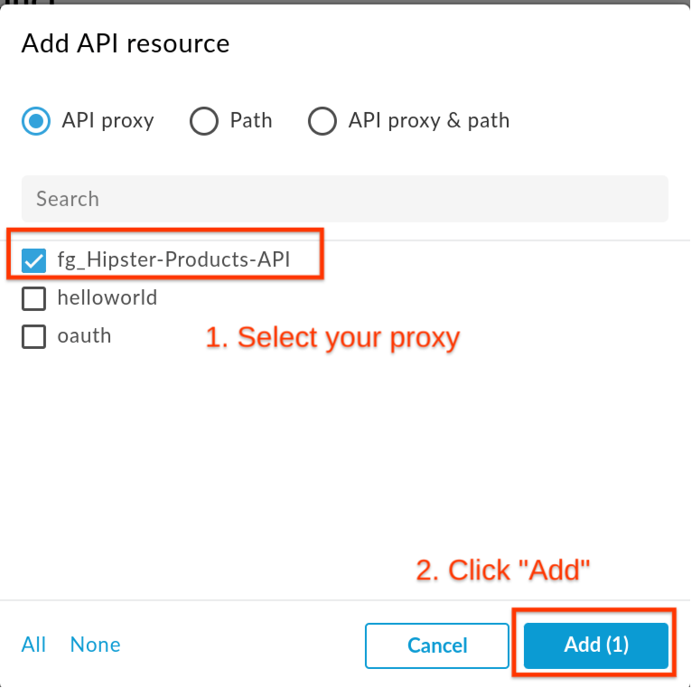
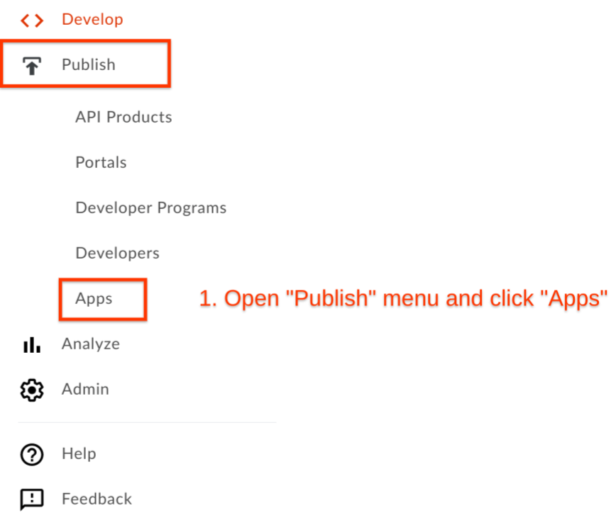
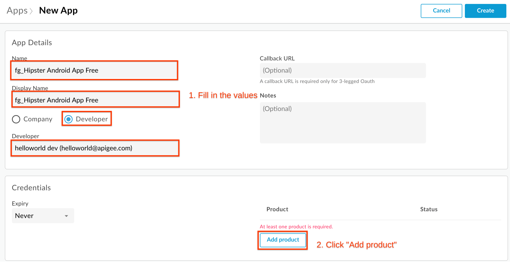
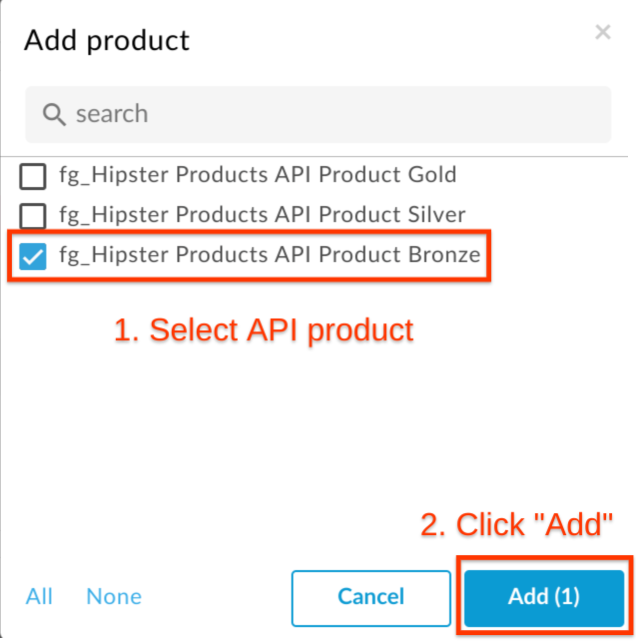
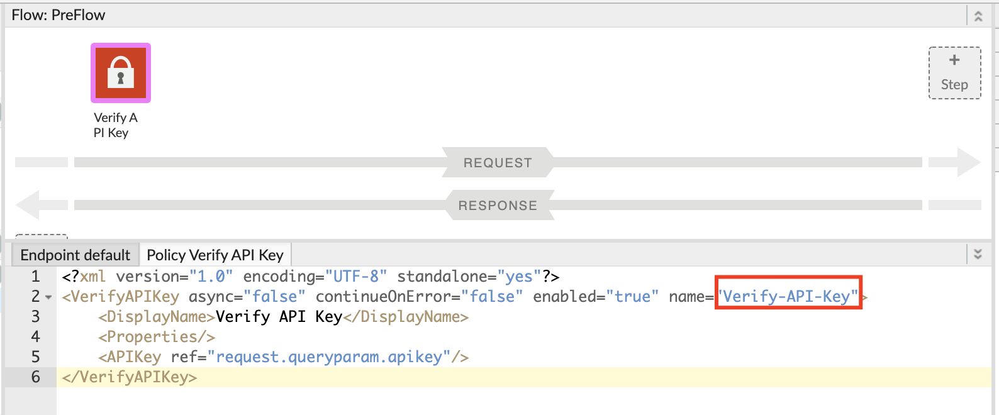
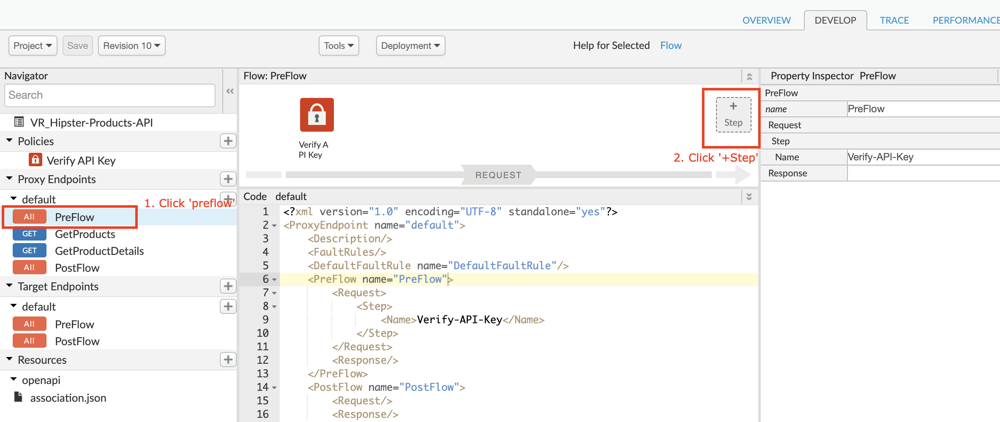
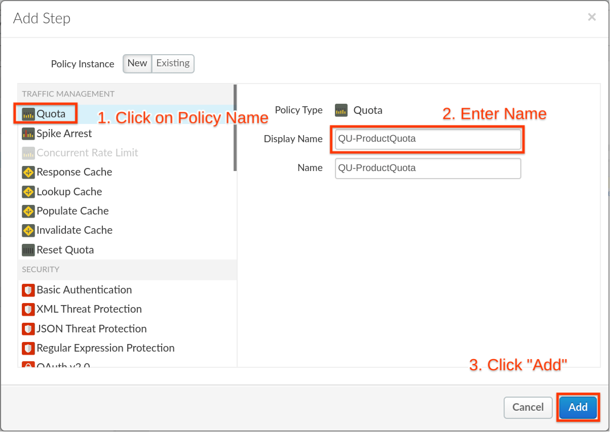
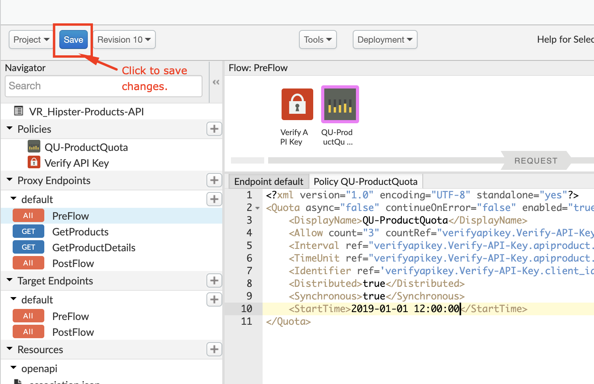
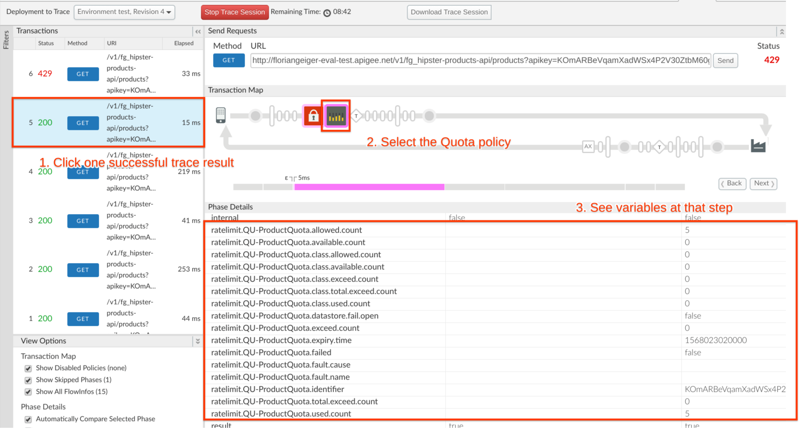

# Lab 3 - Manage tiered API Product subscription through API call quotas

Duration : 15 mins

Persona : API Product Team & API Dev Team

# Use Case

API tiering is a new look at API as a Product. With tiering you provide the base level (e.g. bronze) as a free option. This offer is an entry point to leverage your data offering in an upsell. The goal is to upsell to additional functional levels. This term is also known as "freemium". The approach it follows a very basic approach – offer basic functions or call quotas as an entry level and if more data access or more functionality is required, offer this for a fee. This gives developers the chance to have a working prototype and explore your API in a real life scenario before making an informed purchase decision.

# How can Apigee help

Apigee offers the concept of API Products abstracted from the functional logic of API proxies. The proxies can access the limits defined in API Products. This way the API product team can focus on the business logic (e.g. setting quotas per product) while the API development team works with these values to implement the parametrized behaviour.

# Pre-requisites

Pre-reqs are met if you have completed [Lab 1](../Lab%201) and [Lab 2](../Lab%202).

The minimum for this lab is to have a deployed API proxy with a "Verify API Key" policy and a Developer for who we can register an App with our API product.

# Instructions

In this lab we will create different API products that bundle the same API proxy but with different quotas attached to it.

## Create API Products (Bronze, Silver, Gold)

* Go to [https://apigee.com/edge](https://apigee.com/edge) and log in. This is the Edge management UI

* Select **Publish → API Products**

* Click **+API Product**


* Populate the following fields

    * Section: Product details

        * Name: {yourInitials}\_Hipster-Products-API-Product-Bronze

        * Display name: {yourInitials}\_Hipster Products API Product Bronze

        * Description: Free version of the Hipster Product API

        * Environment: test

        * Access: Public

        * Quota: **5** requests every **1 Minute**

    * Section: API resources

        * Click the **Add a proxy** link



* Select **{yourInitials}_Hipster-Products-API Proxy** and click **Add**



API products have a set of fields called "Quota" that allow you to configure how many requests per number of time periods (e.g. 5 requests per 1 second) you want to allow. Just configuring this does NOT enforce quotas though! This is just a definition that the quota policy that we define in the next steps picks up dynamically.

* Click **Save** to create the API Product

We now create 2 similar products that represent our Silver and Gold Products with different Quota settings. To create another API Product just follow these steps:

* Click **Publish → API Products**

* Click **+API Product**

* For the **Silver Product** populate the following fields

    * Section: Product details

        * Name: {yourInitials}\_Hipster-Products-API-Product-Silver

        * Display name: {yourInitials}\_Hipster Products API Product Silver

        * Description: Basic version of the Hipster Product API

        * Environment: test

        * Access: Public

        * Quota: **20** requests every **1 Minute**

    * Section: API resources

        * Click the **Add a proxy** link

        * Select **{yourInitials}_Hipster-Products-API Proxy** and click **Add**

* For the **Gold Product** populate the following fields

    * Section: Product details

        * Name: {yourInitials}\_Hipster-Products-API-Product-Gold

        * Display name: {yourInitials}\_Hipster Products API Product Gold

        * Description: Deluxe version of the Hipster Product API

        * Environment: test

        * Access: Public

        * Quota: **1000** requests every **1 Minute**

    * Section: API resources

        * Click the **Add a proxy** link

        * Select **{yourInitials}_Hipster-Products-API Proxy** and click **Add**

Now we should end up with 3 API Products resembling our Product tier strategy.


## Create an App for our Products

* Select **Publish → Apps**

* Click **+API Product**




* Populate the following fields

    * Section: App Details

        * Name: {yourInitials}\_Hipster Android App Free

        * Display name: {yourInitials}\_Hipster Android App Free

        * Developer: Chose any existing Developer

    * Section: Credentials

        * Click **Add product**



 * Select **Hipster Product API Product Bronze** and click **Add**



* Click **Create** to create the App

* Note down the Key for later by clicking on "Show" in the App properties.


Repeat the process for the Apps that use the Silver and Gold tier as well, with using these values:

* App using the Silver API Product

    * Section: App Details

        * Name: {yourInitials}\_Hipster Android App Basic

        * Display name: {yourInitials}\_Hipster Android App Basic

        * Developer: Chose any existing Developer

    * Section: Credentials

        * Click **Add product**

        * Select **Hipster Product API Product Silver** and click **Add**

* App using the Gold API Product

    * Section: App Details

        * Name: {yourInitials}\_Hipster Android App Deluxe

        * Display name: {yourInitials}\_Hipster Android App Deluxe

        * Developer: Chose any existing Developer

    * Section: Credentials

        * Click **Add product**

        * Select **Hipster Product API Product Gold** and click **Add**

You should end up having 3 Apps with 3 different API keys, that you have noted down.


## Create and Configure Quota Policy

As stated before, quotas are only enforced by adding a quota policy into your proxies. With the configuration of the API Product Quota fields in the API product this will populate the necessary variables that are available in your proxy, which then can be fed into a quota policy.

1. Click on **Develop → API Proxies** from side navigation menu. Open the existing API Proxy from the prerequisites.

2. Verify that the policy for Verify API Key exists with the proper name. Click on the **Policy Name** and look at the XML configuration below.



3. Click **PreFlow** and **+ Step** to add a new policy



4. Click **Quota** Policy and Populate the following fields

    1. **Display Name:** QU-ProductQuota

Click **Add** to add the policy to your flow.



5. With the VerifyAPIKey policy that we have configured in our prerequisites **Verify-API-Key**, the following variables are populated after verification of an API key that has an API product with the quota fields set as 3 requests per 1 second:

* verifyapikey.Verify-API-Key.apiproduct.developer.quota.limit = 3
* verifyapikey.Verify-API-Key.apiproduct.developer.quota.interval = 1
* verifyapikey.Verify-API-Key.apiproduct.developer.quota.timeunit = second


The next step then is to set the **QU-ProductQuota** Quota policy to reference these variables and use this code in the **Policy Configuration**

```
<?xml version="1.0" encoding="UTF-8" standalone="yes"?>
<Quota async="false" continueOnError="false" enabled="true" name="QU-ProductQuota" type="calendar">
    <DisplayName>QU-ProductQuota</DisplayName>
    <Allow count="3" countRef="verifyapikey.Verify-API-Key.apiproduct.developer.quota.limit"/>
    <Interval ref="verifyapikey.Verify-API-Key.apiproduct.developer.quota.interval">1</Interval>
    <TimeUnit ref="verifyapikey.Verify-API-Key.apiproduct.developer.quota.timeunit">minute</TimeUnit>
    <Identifier ref='verifyapikey.Verify-API-Key.client_id'/>
    <Distributed>true</Distributed>
    <Synchronous>true</Synchronous>
    <StartTime>2019-01-01 12:00:00</StartTime>
</Quota>
```


Note: If the field is not set in the API product, this would allow a default of 3 calls per minute

6. Click on **Save** after you have changed the policy in the previous step



## Test the results

Go to the API proxy and enter the trace tab so we can run some tests:

* Click **Trace**

* Click **Start Trace Session**

* Add the Bronze apikey value as a query parameter to the URL (e.g.: [http://{yourapigeeorg}-test.apigee.net/v1/{yourInitials}\_hipster-products-api/products?apikey=GYuZekimsQ2TLdWWMHkqB1poAquHaGsv](http://{yourapigeeorg}-test.apigee.net/v1/{yourInitials}_hipster-products-api/products?apikey=GYuZekimsQ2TLdWWMHkqB1poAquHaGsv)

* Run a test by clicking the **Send** button multiple times


* After 6 calls we see that our free quota of 5 calls is exceeded and the quota policy shows a red exclamation mark sign


Now we switch API products and add the Silver apikey value from our App as a query parameter to the URL (e.g.: [http://{yourapigeeorg}-test.apigee.net/v1/{yourInitials}\_hipster-products-api/products?apikey=GYuZekimsQ2TLdWWMHkqB1poAquHaGsv](http://{yourapigeeorg}-test.apigee.net/v1/{yourInitials}_hipster-products-api/products?apikey=GYuZekimsQ2TLdWWMHkqB1poAquHaGsv)

* Change your apikey parameter to match your Silver App credentials

* Run a test by clicking the **Send** button around 15 times before clicking **Start Trace Session**

* Start the trace session and click the **Send** button a couple of times again before reaching your limit.

Let's check out the trace result:

* Click on one of the successful trace results on the left (indicated by a green Status with 200)

* Click the quota policy icon in the Transaction Map



* Here we see at the end of our calls that we only have one count available (ratelimit.QU-ProductQuota.available.count) out of the original 20 (ratelimit.QU-ProductQuota.allowed.count).

* Also have a look at the other variables available as part of the proxy flow.

At this point, we will skip the Deluxe/Gold version of our product, but you get the idea, that your developers won't easily reach the limit with this one.

# Quiz

1. What would happen if you leave out the Identifier Tag in the Quota Policy?

2. What would happen if the Quota Policy were placed before the Verify API Key policy?

3. In the configuration we provided the ‘Distributed’ and ‘Synchronous’ attributes were both set to ‘true’. What is the implication if we set these to ‘false’?

4. How would you configure the quota so that POST calls are counted as 2 calls for the purposes of evaluating the quota?

# Summary

In this lab you have created 3 products aligned with your API product strategy to offer a tiered model and have different quotas attached to each product. We have not defined the limits in our API proxies but made the same proxy available as different API products that define the quota amount.

# References

## Apigee Docs Links

[https://docs.apigee.com/api-platform/reference/policies/quota-policy](https://docs.apigee.com/api-platform/reference/policies/quota-policy)

## Videos (4mv4d)

[https://www.youtube.com/watch?v=z8Rj_VzSbh4](https://www.youtube.com/watch?v=z8Rj_VzSbh4)

[https://www.youtube.com/watch?v=1RDDpH0wOdc](https://www.youtube.com/watch?v=1RDDpH0wOdc)

## Next Steps

Now go to [Lab-4](../Lab%204)
